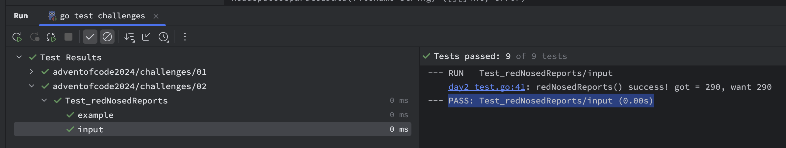

# adventofcode2024

This repository contains my solutions for the
[Advent of Code 2024](https://adventofcode.com/2024) challenges.

> NOTE: 
> The tests contain the solutions for the puzzles. If you want to solve them yourself, please do not look at the
> tests ;)

Similar to last year, my personal approach is to solve the puzzles using

* GoLang
* Test-Driven-Development (TDD)

In addition, I want to use this repository to learn more about GoLang.
As a side effect I will also note down the time the tests take to run on the different puzzles so maybe this can be
compared to other languages or implementations.
This will only count the test execution time for the main input data and not the example-data.
I'm running these tests on a MacBook Pro 2021 with an Apple M1 Max processor and the IntelliJ IDEA IDE.

| Day | Run Duration               |
|-----|----------------------------|
| 01  | 0.00s                      |
| 02  | 0.00s                      |
| 03  | 0.00s                      |
| 04  | 0.01s                      |
| 05  | 0.00s                      |
| 06  | 0.53s                      |
| 07  | 2.93s (0.55s parallel)     |
| 08  | 0.00s                      |
| 09  | 0.13s                      |
| 10  | 0.00s                      |
| 11  | 0.02s                      |
| 12  | 0.32s                      |
| 13  | 0.00s (after improvements) |
| 14  | 0.00s                      |
| 15  | 0.00s                      |
| 16  | 0.07s                      |
| 17  | 0.00s                      |
| 18  | 0.40s                      |
|     |                            |
